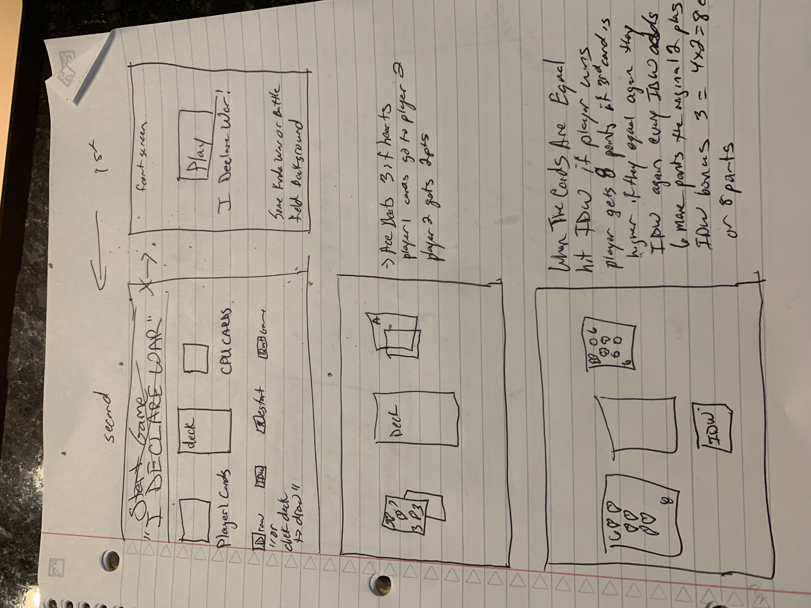
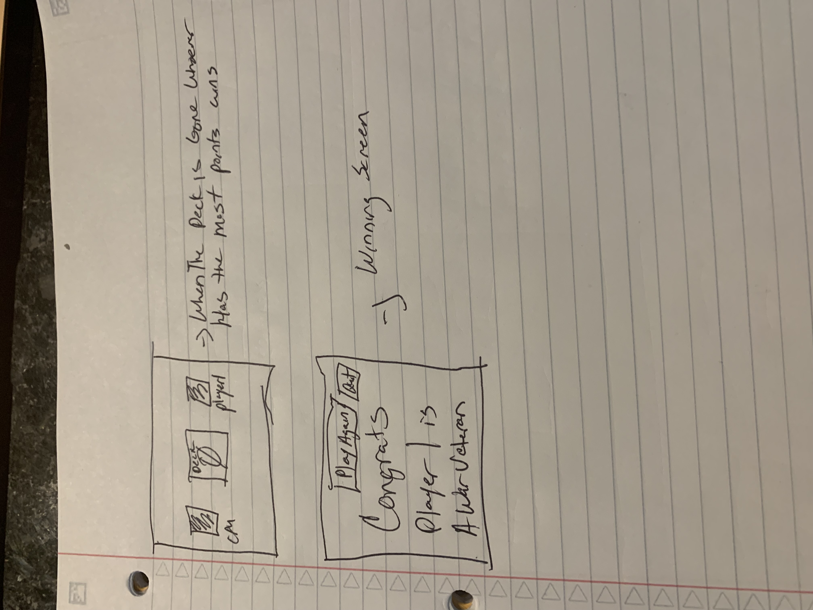

Welcome To A Game Of I Declare War 
In This Game There Will Be 52 Cards
The Player Will Take Turns Against The Computer, Plucking Cards From The Deck 
Who Ever Receives The Higher Card Once They Pluck, Recieves The Cards For That Round. 
Who ever collects the most cards at the end of the game will win. 
There are 52 Cards So There Will be A Total Of 52 rounds at max.
If in a round the customer and user pluck the same value of cards meaning they are equal. The User and the Computer player will then pluck 3 more cards who ever has the highest value of the 3rd card will collect that group of cards.
Provided yall have the same card you have to declare war with your opponent by saying "I Declare War" Each word a card is plucked the 3rd card is exposed the higher value between th two players wins that collection of cards thats all in one round.
Once the players get to the end of the deck they will count the cards and determine the winner by who has the most cards.
The computer will go first after each game is over cards should shuffle and the customer should be able to restart the game or exit the game.

